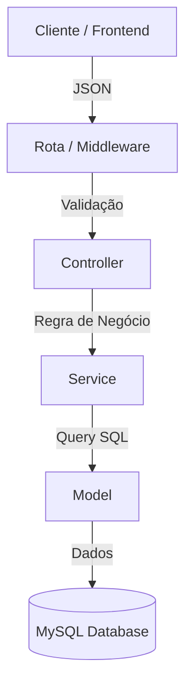

# 🌐 GAP — Sistema de Gestão e Administração Pessoal


<!-- ALL-CONTRIBUTORS-BADGE:START -->
[](#contributors-)
<!-- ALL-CONTRIBUTORS-BADGE:END -->

O **GAP** é um sistema para **gestão financeira e administração de permissões**, desenvolvido com foco em segurança e escalabilidade corporativa.  
Gerencie finanças pessoais, usuários e permissões hierárquicas com robustez e simplicidade.

---

## ⭐ Contribuidores do GitHub

Agradecimentos aos desenvolvedores do projeto!

<table>
  <tbody>
    <tr>
      <!-- Luiz Gustavo -->
      <td align="center" width="20%">
        <a href="https://github.com/gusta-xis">
          
          <br />
          <sub><b>Luiz Gustavo</b></sub>
        </a>
        <br />
        <a href="https://www.linkedin.com/in/devdamascena/">
          
        </a>
      </td>
    </tr>
  </tbody>
</table>

---

## ✨ Funcionalidades

- **Gestão Financeira**: Controle de despesas fixas, variáveis, salários e metas.
- **Hierarquia RBAC**: 4 Níveis de acesso (Super Admin, Gerente, Admin, Usuário).
- **Segurança Avançada**: 
  - Login com Access/Refresh Tokens.
  - Sanitização automática de inputs.
  - Proteção contra Brute-force e XSS.
- **Dashboard**: Visualização gráfica de metas e gastos em tempo real.
- **API REST**: Arquitetura organizada e documentada.

---

# 🛠 Tecnologias

## 🚀 Back-end


---

## 🎨 Front-end


---

## �️ Banco de Dados


- Tabelas principais: **Users**, **Gastos_Variaveis**, **Gastos_Fixos**, **Metas**
- Relacionamentos robustos via Foreign Keys.
- Migrações automáticas via código (Sync Check).

---

## 🧱 Arquitetura


### Organização
- **Controllers**: Recebem requisições e validam permissões.
- **Services**: Contêm a lógica de negócio pura.
- **Models**: Interagem com o banco de dados (DAOs).

### Fluxo de Dados



---

## 🤝 Como contribuir

Contribuições são super bem-vindas!  

1. Faça um **fork**  
2. Crie uma branch:
    ```bash
    git checkout -b feature/minha-melhoria
    ```
3. Faça suas alterações e commit:
    ```bash
    git commit -m "feat: adicionar nova funcionalidade"
    ```
4. Envie a branch:
    ```bash 
    git push origin feature/minha-melhoria
    ```
5. Abra um Pull Request ❤️

---
